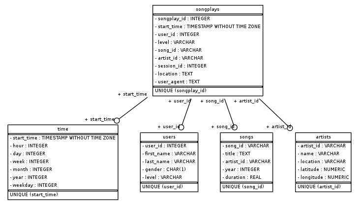

# Data Modeling with Postgres

## Context
A startup company Sparkify wants to analyze the data collected on songs and users activities on their new music streaming app in order to unserstand what songs users are listening to. Currently, they do not have an easy way to query their data, which resides in a directory of JSON logs on user activity on the app, as well as a directory with JSON metadata on the songs in their app.

The task for the project is to create a Postgres database with tables designed to optimize queries on song play analysis. A database schema and ETL pipeline are created for analysis in the meantime. At last, test the database and ETL pipeline by running queries, and compare the results with the expected results.

## DataSet
* **Song Datasets**: The first is the song dataset that is a subset of real data from [Million Song Dataset](https://labrosa.ee.columbia.edu/millionsong/).Each file is in JSON format and contains metadata about a song and the artist of that song. The files are partitioned by the first three letters of each song's track ID. Below is an example of what a single song file.

'''python
{"num_songs": 1, "artist_id": "ARJIE2Y1187B994AB7", "artist_latitude": null, "artist_longitude": null, "artist_location": "", "artist_name": "Line Renaud", "song_id": "SOUPIRU12A6D4FA1E1", "title": "Der Kleine Dompfaff", "duration": 152.92036, "year": 0}
'''

* **Log Dataset**: The second dataset consists of log files in JSON format generated by this [event simulator](https://github.com/Interana/eventsim) based on the songs in the dataset above. These simulate activity logs from a music streaming app based on specified configurations. The log files in the dataset you'll be working with are partitioned by year and month. For example, here are filepaths to two files in this dataset.

If you would like to look at the JSON data, you will need to create a pandas dataframe to read the data.
'''python
import pandas as pd

df = pd.read_json(filepath, lines=True)
'''

## Setup

### Create Tables
1. Write 'CREATE', 'INSERT', 'DROP' statements in 'sql_queries.py' to creat all tables.
2. Run 'create_tables.py' in the console to create the database and tables
'''bash
python create_tables.py
''' 
### Build ETL Process and Pipeline
1. Complete 'etl.ipynb' notebook to develop ETL processes for each table and make sure the records insertion is successful. Check the process by running 'test.ipynb'
2. Complete 'etl.py' where the entire datasets are processed similar as the notebook. 
3. Run 'etl.py' in the console to insert all records to each table.
'''bash
python etl.py
''' 

## Database Schema
A star schema is created with a fact table (songplays) and the rest dimension tables surrounded the fact table. 
 | Dimension Tables|
 | --------------- |
 | users |
 | songs |
 | artists |
 | time |
