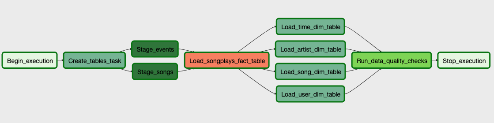

# Data Pipeline with Airflow
A music streaming startup, Sparkify, has grown their user base and song database even more and want to move their data warehouse to a data lake. Their data resides in S3, in a directory of JSON logs on user activity on the app, as well as a directory with JSON metadata on the songs in their app.

In this project, we would create custom operators to create tables, load tables, stage the data and check data quality.

## Project Dataset
The dataset for this project are stored in S3. The file path for each dataset is:
* **Song data** have infomation about songs and artists. All files are in the same directory.
         '''bash s3://udacity-dend/song_data '''
* **Log data** have infomation about evnets of the users.
         ''' bash s3://udacity-dend/log_data '''

## Project Setup
Navigate to Airflow UI --> Admin --> Connections --> Create the following conncections

### 1. AWS Connection
* Conn Id: aws_credentials
* Conn Type: Amazon Web Services
* Login: Your IAM Access Key ID
* Password: Your IAM Secret Key

### 2. Redshift
* Conn Id: redshift
* Conn Type: Postgres
* Host: the endpoint of your Redshift cluster on AWS
* Schema: database you wish to connect to in your Redshift cluster
* Login: admin user name of your Redshift cluster
* Password: the password created when launching the Redshift cluster
* Port: 5439

## Task Dependencies

DAG parameters:
* DAG will run on hourly basis
* The task will retry 3 times on failure
* Retry will happen every 5 minutes
* The DAG does not depend on past runs
* Email is not sent on retry
